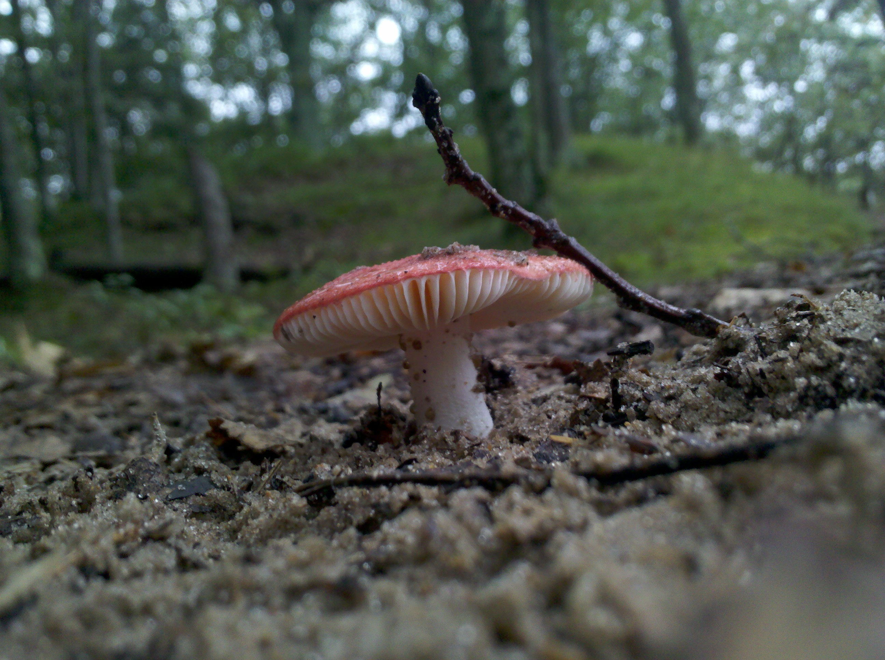
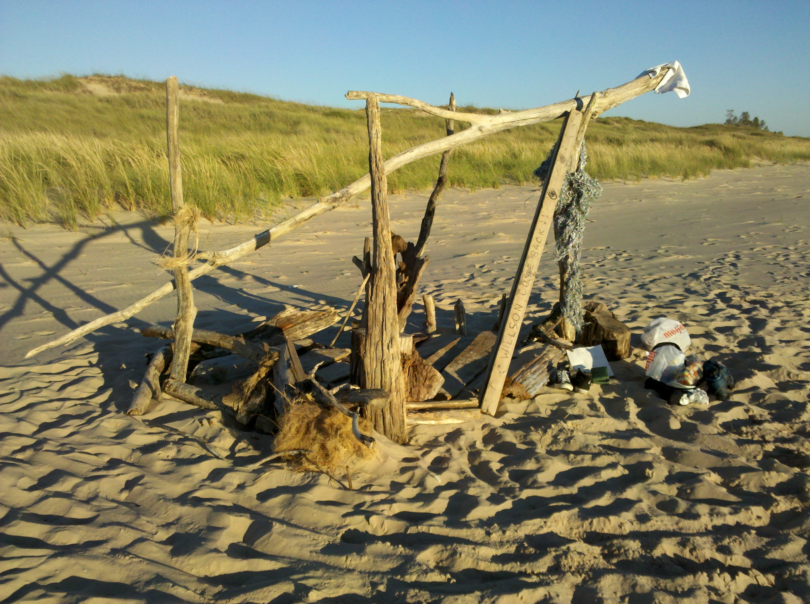
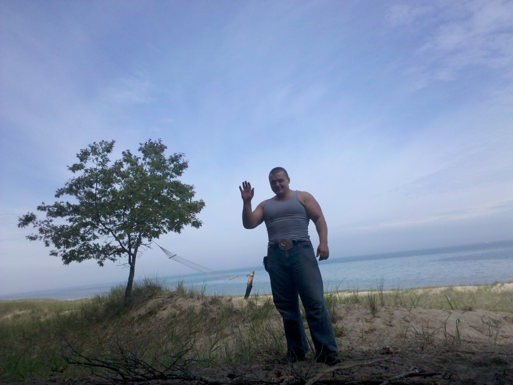

Captain's Log: Quarantine. Day Twenty,

the promised day of rhyme a plenty.

I am sitting here with my salad,

expecting to write world's littlest ballad.

I waited until the conclusion of day,

to see with what rhymes that may pay.

Alas, twenty just about rhymes with plenty,

it rhymes as good as yeti and orange.

On the other hand Twenty One,

rhymes with all under the sun.

I am sitting here smacking my lips,

Counting down 90 days to Penumbral Eclipse.

I made little sausages to add to my salad,

I added really spicy dressing to spruce up my ballad.

My Little Fort (note orange tent in the center)

As I grilled the little things, I remembered that same smell,

it was back when I lived in the ancient dune wilderness.

Little Sausage Dinner

That memory really rings a bell,

It was at the height of my loneliness.

My Evening Couch, as I waited for Lake Michigan Sunsets

Deep woods, ancient dunes,

and warm and sunny afternoons.

Deep in Woods

Not all afternoons were sunny, I once got a heck of a reminder,

One cold afternoon I remembered that I get scared of thunder.

And My Evening Wear

Not, little thunder of course,

the scary ones, that always strike with great force.

Dark Evening

It was almost never scary, certainly never scary for long,

it would pass, and moon or sun would rise, followed by birdsong.

People taking photos of my Horses

I remember by the beach many stood,

as I built horses out of driftwood,

Horse 2.0

Horse 3.0

The height of my loneliness,

also came with a great deal of silliness,

Beach House

Beach House

I waived to the future, and to today,

Look at me, I am a Cowboy! Say, Hey!

Howdy!
