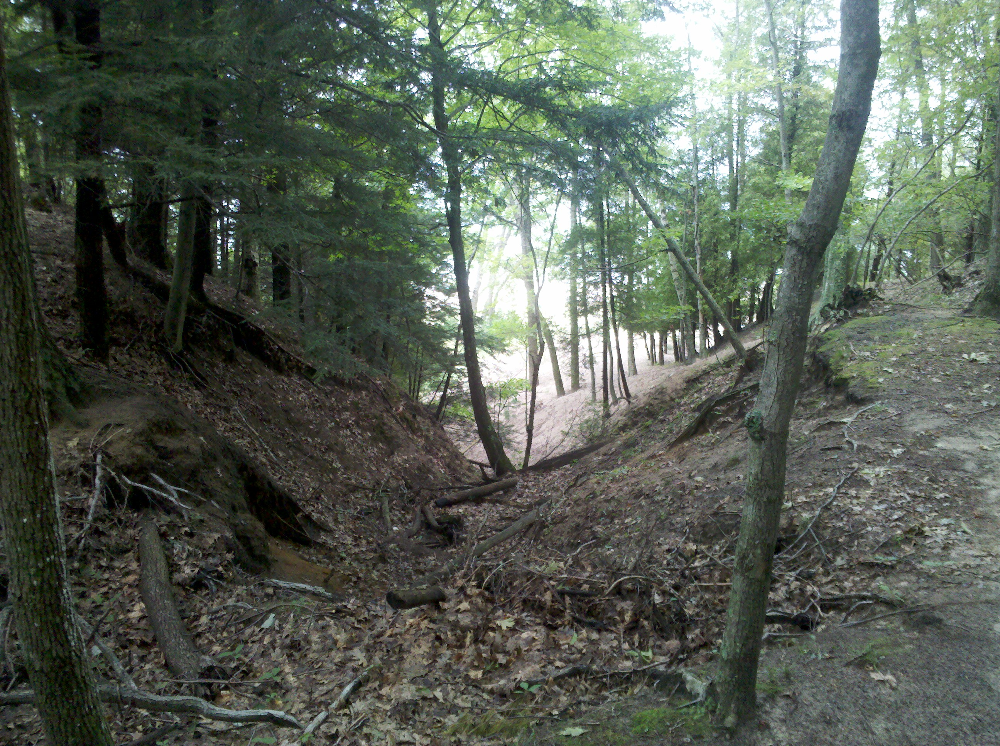

Oh it was cold that morning,

the sudden change came without warning.

While the sunsets are over the sea,

the sunrise, must rise from behind dunes.

There are no dunes taller than these,

they are ancient, born of frozen seas.

The deer were the first to rise,

to them belonged the sunrise.

There is a place where the dunes part,

by some unknown art.

The deers come out,

it is their lake, no doubt.

When the sun finally made it,

the warm air rolled down the dune.

The symphony of the ancient forest,

perfectly in tune.

Then the birds rose,

and their breakfast followed.

Two eagles came by,

to keep an eye from the sky.

My beloved Seagull friend and I rejoiced,

another perfect morning.

(My seagull friend's name is Bob.

I called them all Bob.

I had difficulty telling them apart,

but I sure got their names right.

Seaguls, are the kittens of the sea,

and they are all very mighty.)
