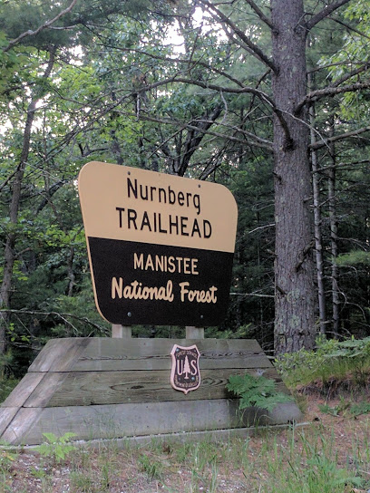

Wherever I went, Friday magically followed,

there always seem to have been a tree that was hollowed,

And the moment I looked at food,

he knew, dinner was going to be good.

Wherever the Raccoons came out at night,

Friday, was always there, my Fat Spirit Guide.

Over at Little Torch Key, at Veterans Beach, with easy access to water,

he lived up a Palm Tree, with his Furry Wife and Tiny Daughter,

Once I got lonely, and threw a little Tortilla all the way up there,

he popped up, and it looked like he smiled - I swear.

Over at Ludington State Park, at the Jack Pine Hike-in Campground,

I woke up at 3 am, hearing a strange sound.

He was trying to pull out my hamburger buns,

probably to feed all his furry sons.

The bag was tied, up in a tree,

nothing could stop him - Because he was free.

I got out of my tent, and delivered his late night bite,

by tossing it into my cranky neighbor's camp site.

The whole woodland family, knew that eventually I had to go back,

Friday left a little footprint on my pillow, to help me pack.

I was staying up in the trees, on top of ancient dunes,

the only light was that of stars, and the moon's.

I called them \[Nordhouse Skylands]\[1],

but, if you go out there, be ready for his smart little hands,

Bring a travel lock to secure the zippers on your tent,

and remember, Friday loves you as friend, he means no ill intent.

My Dear Readers, we may each need a few weeks of Wilderness in our life,

so start slowly packing, buy a backpack, bug spray, and a knife,

And just keep your adventure pack by the door,

if life ever gets you down, smile! and head for that Lake Michigan shore.

You can park at the \[Nurnberg Trailhead]\[2],

and don't forget to bring a little bit of stinky cheese,

and piece of stale bread.

\*\*\*

[Raccoon photo](https://commons.wikimedia.org/wiki/File:Raccoon_\(Procyon_lotor\)_2.jpg):

[author](https://de.wikipedia.org/wiki/Benutzer:Darkone),

[license](https://creativecommons.org/licenses/by-sa/2.5/deed.en).

\[1]: <https://goo.gl/maps/wsX31CTTXR4bzhza8>

\[2]: <https://goo.gl/maps/PhyA8hEuiAZnBmt1A>
