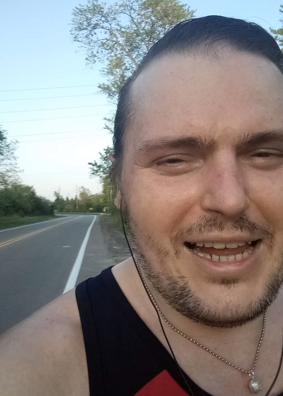

Waiting for the sun to inch down,

before I go out in the town.

My legs have become like two huge potatoes,

but that's life, that's how it goes.

---

There are so many lovely people that notice me out there,

yesterday a cute couple, lady with fancy hair.

A couple of days ago, a gent from the gym,

slowly walking and wondering "Is that him?"

Oh yeah, that was me! I shaved my mustache,

and taught my self to dash.

Sure I run at the speed of a sickly gastropod,

but after my gym-dancing, don't even feel odd.

---

And before that, the ladies in the Jeep,

I didn't wave back, I am sorry, I was in the middle of a huge leap.

And then the first person to notice me in my sluggish swim,

might have been the Trainer! from the gym.

I was really tired in the middle of my early run,

muttering "I can't believe I have to run the same distance, before I am done."

And then I heard "Hi! Andre!" and I instantly regained my strength,

I could have run five times that length.

---

Sure, I am still learning, running tests and trails,

but my aim is one hour, to do the whole five miles.

And you know what, just after two weeks,

I run a lot faster; and I have rosy cheeks!

