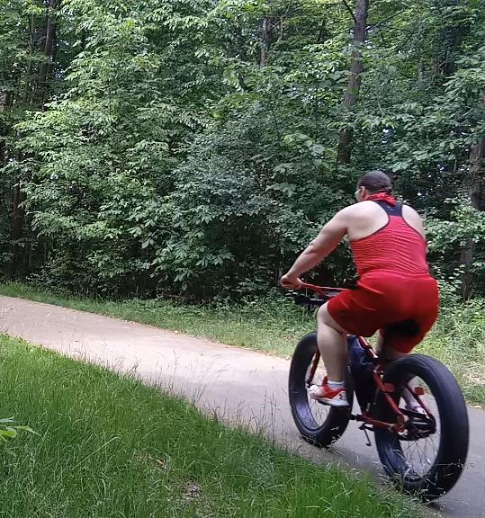

[Watch On YouTube](https://youtu.be/2ctbaoGvikk)

I sprayed myself with sunscreen today,

grabbed my bicycle, and went on my way.

And then,

all of a sudden!

I thought I was attacked by some angry bees,

it turned out to be a mosquito who got me twice, in both knees.

To be fair, I wore my new short pants to be trendy,

but the little sucker didn't need to get me where I am so bendy.

It itched all the way back home with each turn of the bicycle wheel,

... it was indeed a very itchy ordeal.

When I finally got home, I took a vitamin,

and on each knee; I squirted a bit of anti-histamine.

I sat there a bit, wondering "Why me?"

"Why get me twice in each knee?"

To be honest, until I realized that's simply where my new pants ended,

I was feeling pretty gosh darn offended.

