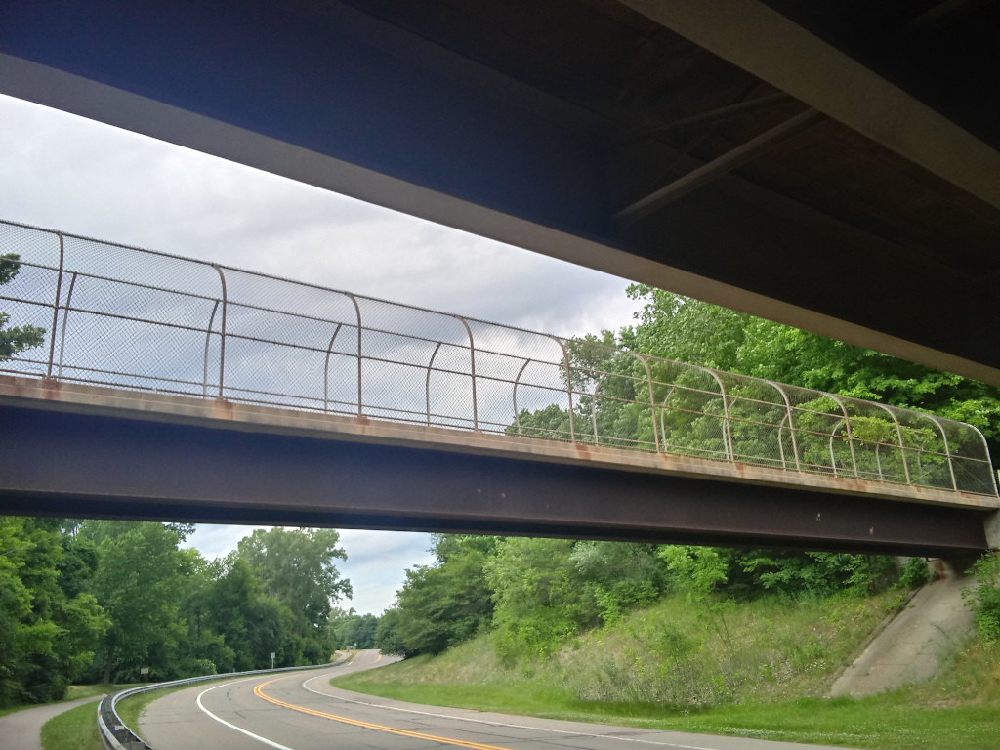

For those of you who had trouble,

finding the Northern end of the I-275 Bicycle Tail.

Hines connects North and South parts,

but it is really hard to find the [North Entry Point](https://goo.gl/maps/AimpKxWarbhiX8zbA)

I got on my bicycle today,

and took some pictures.

You have to find the M-14 Overpass,

or an Overpass with a huge dark rail beneath.

That rail is the support beam,

for the Trail On-ramp.

A bit further down the road,

there is a road that leads up to the On-ramp.

It is a ramp specially made,

for the Handsome Adventurous Bicyclist.

It opens like the door to a secret garden,

very few people bicycle there.

The trail continues for many more miles,

all the way up to 14 Mile Road.

Over at 14 Mile it ends wonderfully unceremoniously,

it just pops out onto a sidewalk.

Where motorists jump in their cars slightly,

as you pop out somewhat dehydrated, a little crazed, and a bit wild.
