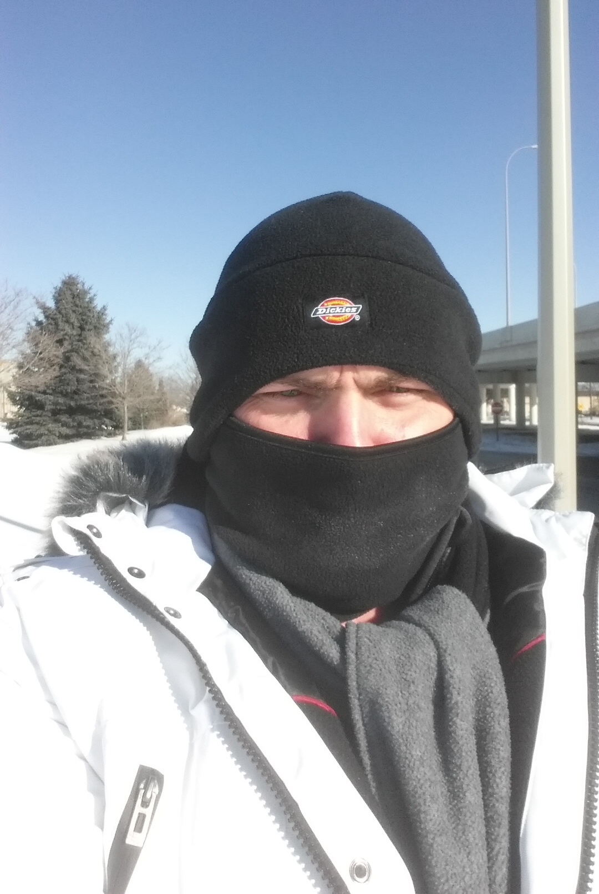
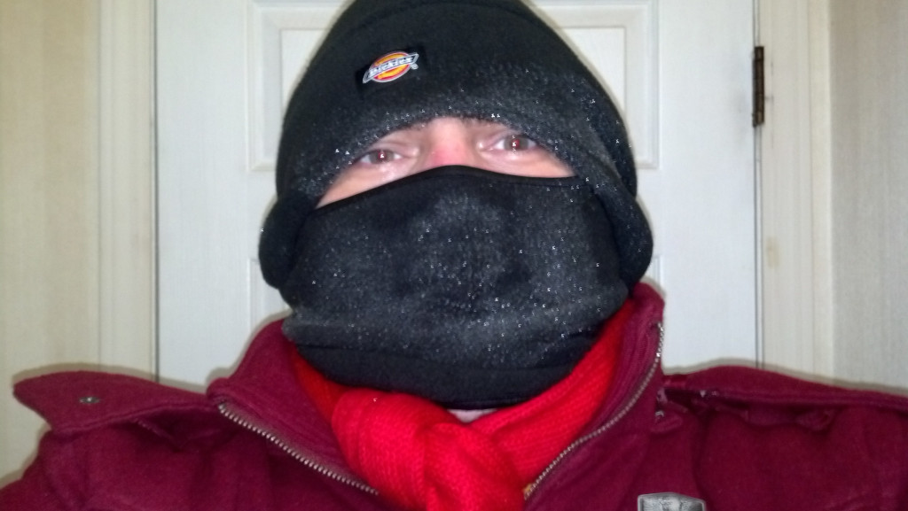
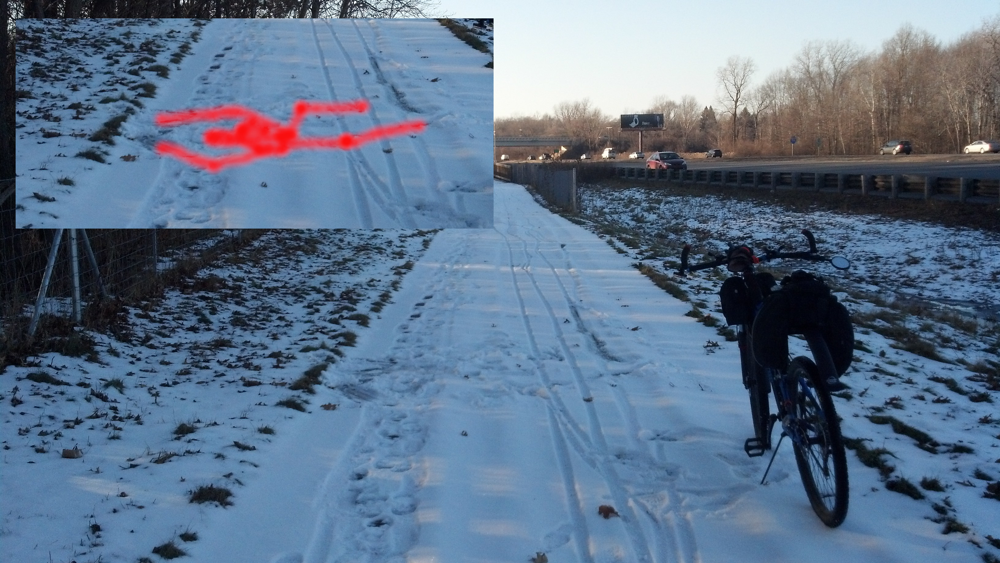

Summer and Winter, Spring, and Autumn are my favorite seasons,

but today, Winter came to mind; for many reasons.

For one, it is Summer, a Hot Summer, Heatwave in full swing,

and I can't believe what great relief; a little snowfall would bring.

And I found a winter photo of an expedition to a near by store,

I look thrice my size, I can't even imagine how many layers I wore.

Then I remembered when back in 2014 the Polar Vortex was all the talk,

I was so excited to dress up and go on a long walk!

But, my favorite memory is riding my bicycle and hitting a patch of ice,

I fell sideways upside-down, and did a little looptie-loop, twice.

I landed perfectly flat with a winter splat kicking up the downy flake,

and I lay there a bit muttering, "What a story this will make".

I love Blinding Summers, and Rainy Autumns, and Spring when all the flowers grow,

but I am a huge fan of Winter and all that bright white snow.
