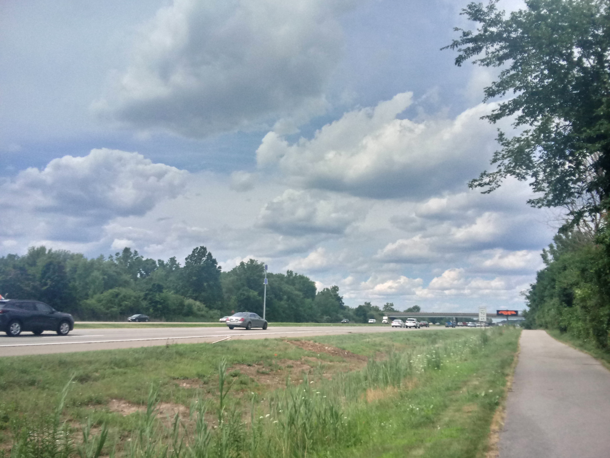
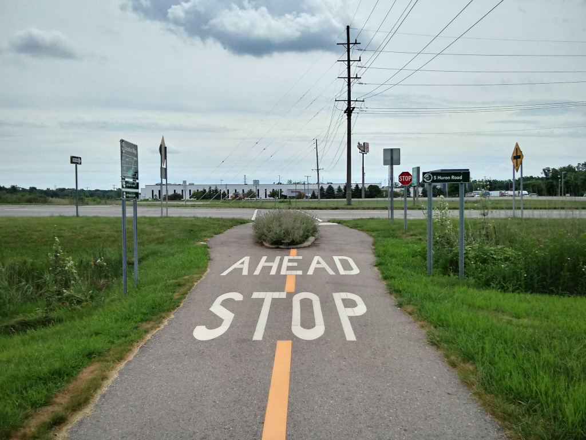

Goooolly, what a beautiful day today was,

I rode around shirtless breaking all the laws.

I woke up this morning and noticed how cloudy,

I looked at my bicycle and said "Howdy!"

I've decided to ride all the way to the end of the trail,

and it took two hours as I rode at the pace of a speedy snail.

Once I finally got to the end and glanced the map,

it said "You are here!" and I said "Yup!"
