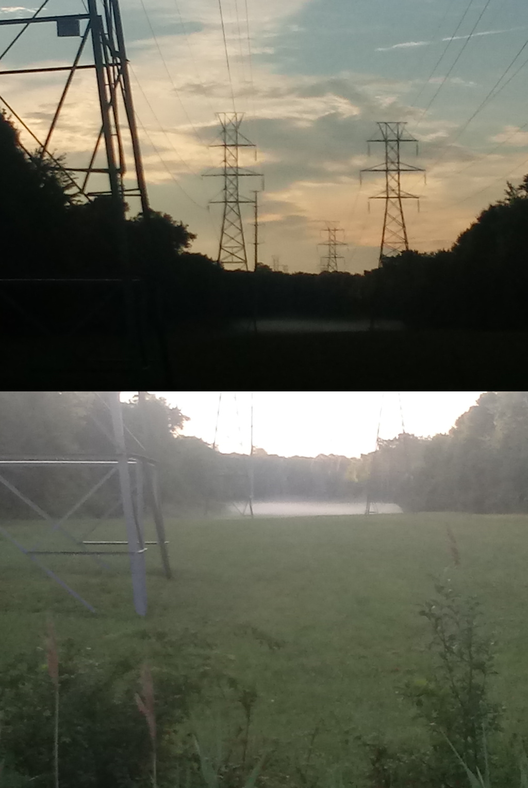

Sure, racing my bicycle is nice late in the day,

but at the end I have to use a flashlight to find my way.

Riding in the morning, the sun becomes so blinding halfway through,

that I have to switch to sunglasses to continue enjoying the view.

---

Mornings have a whole different feel,

empty streets and backwards sun make them all seem unreal.

That fresh fragrance full of chilled morning dew,

now sunlit, creating a strange and mystical view.

This morning I saw a gigantic deer waking up in a grassy patch,

and a hawk probably waiting around for her babies to hatch.

---

Dear Reader, how about you?

what do you love more, evening sunsets or the sunlit dew?

