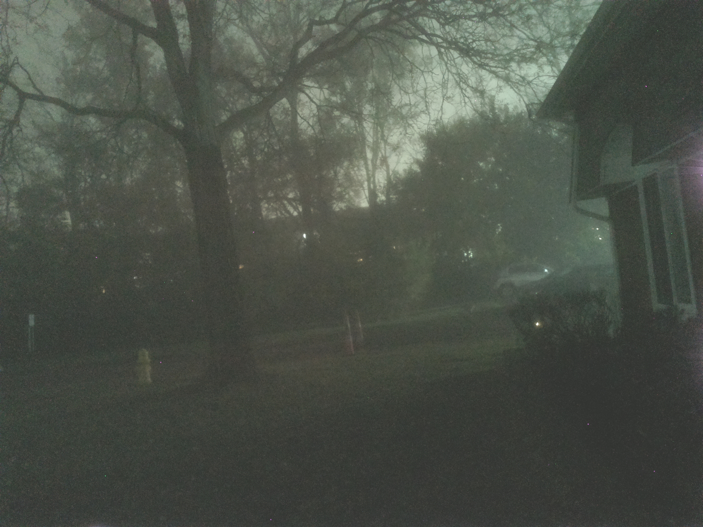

The distance between Science and Play, between Adventurer and Scientist,

approaches zero will approach zero in proportion to just how much fun you are having.

---

My first independent invention was a CD based Car MP3 player in 1998,

there were many other mp3 player patents, dating many years back, I didn't invent anything new.

---

My second invention about 10 year later, was a freaking star-ship,

and it was safe to teenagers fly.

It was a high altitude balloon with a miniature craft that would beam down video and movement of the platform,

to a trailer down on the ground where the crew would be experiencing all the motion in near real time.

Once the balloon pops it would be possible to the dismay of the FAA, and evey other three letter agancy,

to attempt to stair it, the kids in the trailer on the ground would be getting real feedback to whatever the heck they were trying to do.

Once someone slams the deploy parachute button,

the miniature craft would slow its descent, the trailer would shudder.

---

My third invention, from just not too far back was a board game,

but a fascinating one.

Amazon sells see through acrylic padlocks, and deadbolts for locksmith training,

and I realized that one could create a little game out of them.

Basically the players would have to lock-pick their way through the game,

they would each receive a little lock picking kit, which is the real deal.

As a bonus the last door they would have to pick,

was the door to their own house.

This would teach the players to find a quality lock,

and actually help them in real life.

---

And just now, I am toying with the extremely CPU intensive post processing of photographs,

I was just able to bring color to an infrared photo taken in the middle of the night.

There are no practical applications,

I am just looking towards astrography, contemplating the milky way.

Toying with a program called [ZeroMQ](https://en.wikipedia.org/wiki/ZeroMQ),

it is just meant to send information between programs and commuters,

but I can also see that it could control a large array of cameras and I am just wondering what that could mean for slow motion,

super resolution, and things like home made supernovae detection software.

---

It is all fun and games, I am hardly programming any of this, and it is all just about as unscientific as it can be,

but it does help with day dreams, having a bold idea, and looking into it, teaches something.

This kind of exploratory learning, or self education,

if far more powerful than reading textbooks, or listening to lectures.

---

Do not be afraid of imagining interesting things,

take to the microscope, infrared and thermal imaging.

I think self education is the only way to make the world a better place,

treat school for what it is, and don't let it stand between you and real knowledge, and fun.
