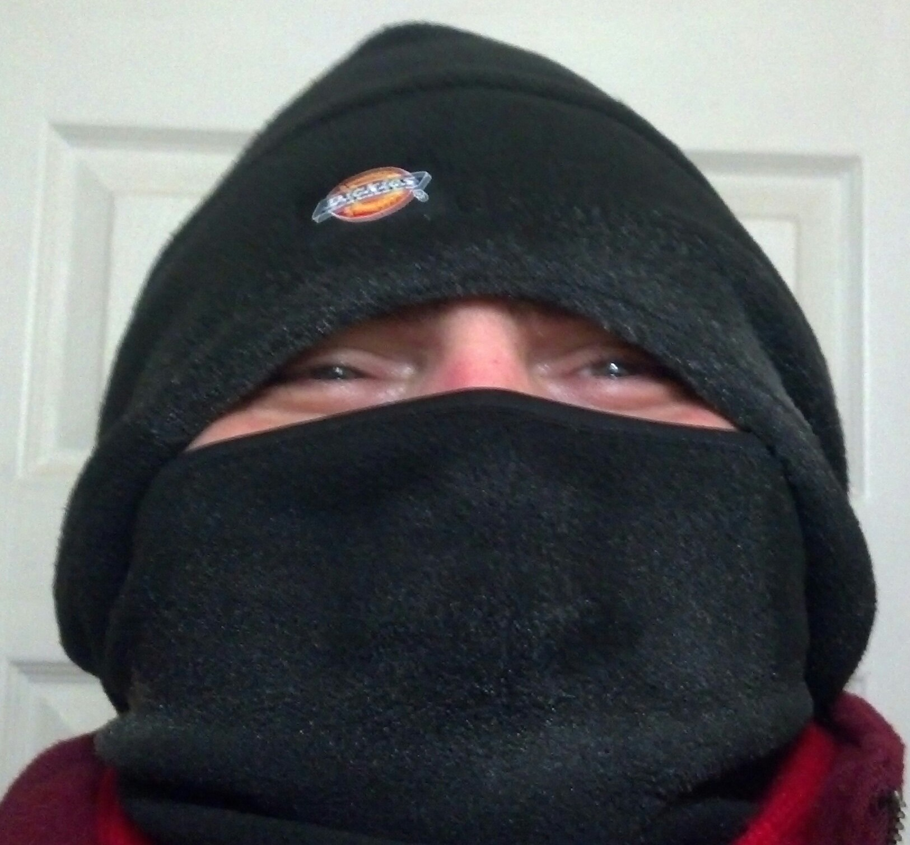

Any adventure,

is an adventure.

You don't have to go far,

though walking will be involved.

Adventures within adventures,

are even more fun.

That's where you go somewhere,

and then explore something else from there.

It is like going to Ludington,

but then marching around Nordhouse Dunes.

Or visiting White Fish Point,

and then trying to find fossils on the beach.

Or even going to the mall with your friends,

and then just people watching instead.

One definition of tiny adventures,

is going somewhere and then learning something new.

But you see, in this modern age we live in now,

this is a lot more exciting than it sounds, because of Audio Books.

Though you maybe walking to the store for a change,

your Audio Book, may transport you to the Appalachian Trail.

There are other things that can spice up your adventures,

it all depends how creative you are.

For example, back in January 2014,

during the gorgeous -16 Fahrenheit Polar Vortex weather in Michigan.

With all the warnings as not to go outside,

and stay home, and drink hot chocolate.

I put on all my clothes, all at once,

and hurried out, for an hour-and-a-half-long expedition.

I wasn't in want for anything,

so I figured I might as well get some little beef jerky sausages.

It didn't seem as cold as everyone made it out to be,

but it did make my sausages; as frosty, as my little adventure fantastic.

