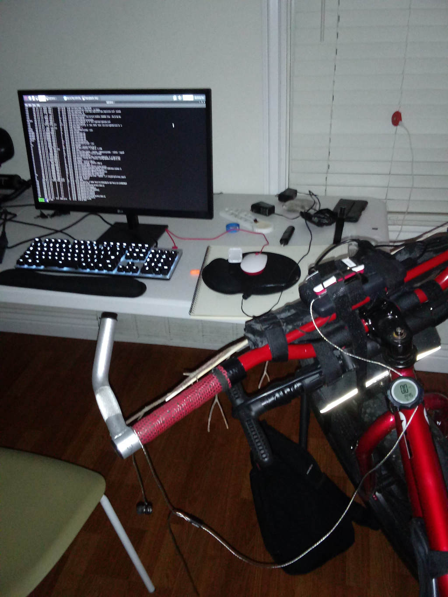

What I discovered is that sometimes, inventors,\
just got to shake a leg.

Where would I be today,\
if I didn't switch to Linux in 1998 or so.

And what would my invention be today,\
if I didn't buy my inexpensive little Raspberry Pi Zero W.

Today,\
I made another tiny leap forward.

---

Instead of continuing my search for a high quality,\
good review Uninterrupted Power Supply board and safe batteries to go along with it.

I simply plugged in my Raspberry Zero Computer into a standard 15,000mAh Energizer power bank,\
that is used for recharging mobile phones.

The Pi immediately started going through the boot process,\
and by the time I sat down by my desktop I was able to connect to it.

---

I am also using an [external USB SoundBLASTER audio card](https://us.creative.com/p/sound-blaster/sound-blaster-play-3),\
and I had to [update my ALSA config](https://learn.adafruit.com/usb-audio-cards-with-a-raspberry-pi/updating-alsa-config) to send the sound through it by setting the card value to "1".

I copied today's workout music to it,\
and then used the `cvlc` command, which is a very simple command line version of the [VLC Media Player](https://www.youtube.com/watch?v=XHprwDJ0-fU).

I just said cvlc \*.mp3 which means play all files that end with .mp3,\
and the moment I hit enter I could hear it playing through my headphones.

---

This is where things get really weird,\
because I strapped the Raspberry to my the Power Bank, and then attached it to my bicycle.

But here is the thing, there is no keyboard there is no screen.\
it is just a power-bank that I connected to Raspberry PI, and then to the sound card dongle, and my headphones.

It is a fully featured computer with proper Linux,\
even a Desktop GUI, but all it does is play music through the headphones.

Just in case, I put the running cvlc program into the background,\
and then disowned it, so that when I bicycle away from my WIFI, and lose the login session my music will still be playing.

It turned out that was not necessary, after a 10 mile bicycle run,\
with a long stop to adjust my new wide bicycle seat, drink a bottle of water and snap a photo, (with the unit mounted on my bicycle) it simply reconnected when I got back.

And then I had to end the process, using my desktop computer,\
to stop the music on - what has now become - my Bicycle Linux Server.

---

I don't have any buttons attached to it,\
the only way I can control music, is to bicycle home, which is like 15 minutes from the highway.

Let me tell you, as much as I love Sid,\
[there are only so many times that you can listen to Continental Drift while bicycling](https://www.youtube.com/watch?v=uMuJxd2Gpxo).

---

So I strapped on a Raspberry Pi onto a huge battery,\
and then strapped that on to my bicycle, and had a heck of a time.

There are so many possibilities now,\
[I can connect with my phone to it, and access it using the command line](https://play.google.com/store/apps/details?id=com.termux\&hl=en_US\&gl=US).

Or I can buy a [$3 four-key keypad](https://www.adafruit.com/product/1332),\
and attach it to the battery next to the Pi.

And then use the keys as previous, play, pause, next,\
which would be pretty fun.

I can also attach a [Mini Wireless Keyboard](https://www.amazon.com/Rii-Wireless-Keyboard-Lightweight-Controller/dp/B00I5SW8MC),\
[and then ponder what to to about the screen](https://www.amazon.com/s/ref=nb_sb_noss?url=search-alias%3Delectronics\&field-keywords=Raspberry+OLED).

---

None of these little wonderful questions would exist,\
if I kept trying to find more circuit boards.

Plus I really like using a brand name battery bank,\
as [cheap batteries can be dangerous](https://www.youtube.com/watch?v=CUgbmCSmSNY).

From the look of things if I do end up 3D printing an enclosure,\
it will have to contain the battery bank and the PI, some buttons and a screen.

It is neither going to be small,\
not light.

---

But,\
this is 2021.

I am not sure,\
if it is a good idea for any device, not to be a full blown Linux.

I don't want to plug wires and USB things in the morning,\
to copy my workout music onto the gym audio player.

That is a ridiculous thing to do,\
my desktop should automatically shuffle some songs, adjust the tempo to my current routine...

...and then connect to my audio player,\
and get everything prepared for my workout.

That is how computers are supposed to work,\
they are supposed to be networked together, and require minimal interaction.

---

I know most people would mention the phone here,\
but phones have bad UI, you can't feel the buttons.

At the moment of writing there are only two or three,\
that have a proper Linux OS.

And all the rest of the phones have their OS pretty much closed,\
they don't want to let people into the operating system.

If you can't install your favorite desktop programs on your Phone,\
then it is not really a computer, it is just a cheap toy, that exposes private information to the internet.

---

Learning Linux can be easy,\
and writing command line programs is not very confusing.

Graphic User Interfaces require too much clicking,\
too much context switching, and they can't be connected together.

Taking some time to [figure out how the command line works](https://www.youtube.com/watch?v=UW3UxK4Tiqg),\
and then building or splicing a range of custom electronics, is a fantastic experience.

It is a very educational experience,\
that presents great many technological adventures and lessons along the way.

The shortest path to knowledge,\
is taking that little leap forward, and exploring all the interesting things.
