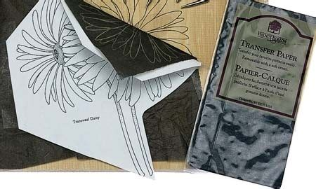

[Drew Struzan - Tracing](https://www.youtube.com/watch?v=0fEMJp70tGU "Play Video")

## Quote by Frida Kahlo

> I never paint dreams or nightmares. I paint my own reality.
>
> \-- Frida Kahlo - https://en.wikipedia.org/wiki/Frida\_Kahlo

## Tracing Paper

Tracing paper does not need batteries, just a pencil.

Anybody can trace a printout of something they like with tracing paper.\
What many don't understand is that after tracing, you need to black out the\
opposite side of your trace to create a home made, Transfer Paper.

[How to Transfer an Image Using Tracing Paper](https://www.youtube.com/watch?v=JW5PYVbc6ho "Play Video")

## Tracing Paper

On the front you have your trace. On the back you deposit as much graphite\
as needed.

Then you place your trace on proper Drawing Paper. Then, go over your trace\
one more time, the graphite on the back will now transfer to your drawing\
paper.

## Graphite Paper

By blacking out the back of your trace you create Graphite Paper.

You can skip this step by buying pre-made Graphite Paper. (Pre-made\
Graphite Paper is a **lot** darker and sharper. If you trace something that\
has a lot of small details, you should use Graphite Paper.)

Now you will place Graphite Paper over your Drawing paper, and then put\
your trace on top, and then go over it with a pencil.

[Graphite Paper on Amazon](https://www.amazon.com/graphite-paper/s?k=graphite+paper).

[Getting Started: Three Ways to Transfer an Image to Watercolor Paper](https://www.youtube.com/watch?v=fN-VtUBC7Ys "Play Video")

## Light Box

Lightbox will help you with tracing and creation of new designs.

A light box is an interesting addition to the process of tracing, it does\
need batteries, or a USB port. When buying an inexpensive light box ($25),\
you might want to consider getting a tiny battery powered [projector](https://www.amazon.com/s?k=Mini+Projector\&ref=nb_sb_noss_2)\
($75) as well.

[Light Boxes Paper on Amazon](https://www.amazon.com/s?k=Light+Box+Tracing\&ref=nb_sb_noss_2).

[How to trace a picture.](https://www.youtube.com/watch?v=cQGeOMCGh0U "Play Video")

## Digital Projector

Digital projectors ($100 - $400) are the fastest way to create murals and\
paintings.

[Digital Projectors on Amazon](https://www.amazon.com/Digital-Projectors/s?k=Digital+Projectors).

[Home Wall Painting Using projector - DIY](https://www.youtube.com/watch?v=iGDfa4T9yTE "Play Video")

## Digital Projector

You can take a selfie, connect your phone to the projector, and begin\
painting.

Even better you can connect your Raspberry PI, or Laptop and use a program\
like [GIMP](https://www.gimp.org/) where you can manipulate your source material to reveal\
edges, colors, or adjust contrast while painting to reveal the brightest\
parts of your source material.

Tip: Consider putting registration marks in your image and on your canvas,\
it is easier to resume your work after you bump the projector or call it a\
night.

Idea: Record your painting progress and upload a sped up movie to YouTube.

## Mona Lisa

Using the Mona Lisa to show what you can get by connecting your projector\
to your laptop, and using a program like [GIMP](https://www.gimp.org/).

## Mona Lisa Edge Detection

Discover all the hard edges where color changes abruptly.

## Mona Lisa Simplified Color Palette

Show the color palette.

## Mona Lisa Highlights

Reveal the brightest parts (highlights) in Mona Lisa.

[How to use GIMP for beginners tutorial](https://www.youtube.com/watch?v=7LXyClky6A8 "Play Video")

[Learn GIMP in 30 minutes, Complete Tutorial for Beginners](https://www.youtube.com/watch?v=IeABb8cwdUg "Play Video")

[Working With Filters - GIMP Tutorials](https://www.youtube.com/watch?v=BB6LM9IYcco "Play Video")

[Sfumato, Unione, Chiaroscuro, Cangiante](https://www.youtube.com/watch?v=Rp4G1pXx-cs "Play Video")

[Painting the Portrait: The Grisaille Method in Oil Part 1/2](https://www.youtube.com/watch?v=1183SVMyJVI "Play Video")

[Painting the Portrait: The Grisaille Method in Oil Part 2/2](https://www.youtube.com/watch?v=vN6aZSSGKGs "Play Video")

[Grisaille Method with Jon deMartin](https://www.youtube.com/watch?v=JPar_nzAEL0 "Play Video")

## Brianna Schretlen and her Fur Kids

"I'm a professional graphic designer and illustrator with a soft spot for\
fur kids. I've always loved painting and drawing animals. Our pets are like\
family, and I truly enjoy working on tributes to these silly, lovable,\
trusting and loyal creatures. In addition to Bri Pet Portraits, I am also\
on Etsy under the shop Bri Baby Art - a shop featuring custom artworks for\
nurseries and kids room decor." (from [BriPetPortraits on Etsy](https://www.etsy.com/shop/BriPetPortraits))

Custom Pet Portraits. Online business where people upload an image, and you\
create a large canvas painting, or drawing. It looks like the price is\
about $50 per portrait. Throw in a bonus, record a time lapse video of the\
painting for advertising, portfolio, and internet points.

[Pet portrait time-lapse.](https://www.youtube.com/watch?v=Aqn363Z1f5A "Play Video")

## Quote by Henri Matisse

> Creativity takes courage.
>
> \-- Henri Matisse - https://en.wikipedia.org/wiki/Henri\_Matisse

## Please, never draw alone.

If you are going to draw with pencils make sure to use blending stumps and\
smudge the graphite to give it a photo-realistic look. Get an [art\
board](https://www.amazon.com/s/ref=nb_sb_noss?url=search-alias%3Darts-crafts\&field-keywords=Sketch+Tote+Drawing+), Drawing Paper (not Sketching Paper), [tin of pencils](https://www.amazon.com/s/ref=nb_sb_noss?url=search-alias%3Doffice-products\&field-keywords=Staedtler+Lumograph+Graphite+Drawing),\
battery powered eraser and eraser shield, and head for the [DIA](https://www.dia.org/), or a\
Museum, or even a Coffee Shop.

[Blending Stumps for Beginners](https://www.youtube.com/watch?v=zHiaJMf7m9Y "Play Video")

[What's an Eraser Shield?](https://www.youtube.com/watch?v=bluffx6sB04 "Play Video")
