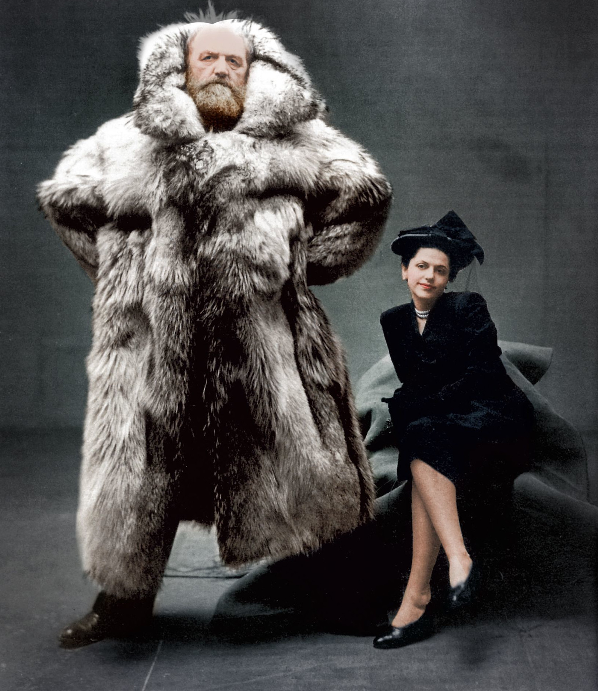

## The Explorer

Danish explorer Peter Freuchen and his wife, Dagmar Cohn (1947)

[How Amelia Earhart Did It](https://www.youtube.com/watch?v=zv1Gqmio7Zg "Play Video")

[Amelia Earhart: Queen Of The Air](https://www.youtube.com/watch?v=k6LsxtFOYFA "Play Video")

[Underwater Discovery and Adventure: The Story of Jacques Cousteau](https://www.youtube.com/watch?v=9z08SD5iRuk "Play Video")

[World Without Sun von Jaques Cousteau](https://www.youtube.com/watch?v=4mp0PA-O_4c "Play Video")

[Shackleton's Voyage of Endurance](https://www.youtube.com/watch?v=HuKUX-7x2Ws "Play Video")

[Retracing Ernest Shackleton's Doomed Expedition To Cross The Antarctic](https://www.youtube.com/watch?v=1jFP7t8JZT8 "Play Video")

[Edmund Hillary and Tenzing Norgay climb Everest - 1953 archive video](https://www.youtube.com/watch?v=X4egTHmDYho "Play Video")

[Sir Edmund Hillary Interviewed by Wade Davis](https://www.youtube.com/watch?v=2e58ZJm7GLg "Play Video")

[Learn to travel -- travel to learn: Robin Esrock at TEDxVancouver](https://www.youtube.com/watch?v=S0TemlxiMdw "Play Video")

[How to travel the world with almost no money by Tomislav Perko](https://www.youtube.com/watch?v=R7vmHGAshi8 "Play Video")

[Travel More & Buy Less. by Luis Vargas](https://www.youtube.com/watch?v=AlCqyZEXM1I "Play Video")

[The value of travel by Rick Steves](https://www.youtube.com/watch?v=kYXiegTXsEs "Play Video")

[How adventure makes you smarter, stronger, and attractive by Tyler Tervooren](https://www.youtube.com/watch?v=2S7Iz38ZDik "Play Video")

[I'm home: How 10 years of travel helped me find belonging by Phil Cha](https://www.youtube.com/watch?v=bXBgitBX5Q0 "Play Video")

[Say 'yes' to your adventure: Matthew Trinetti](https://www.youtube.com/watch?v=H9gh1FpoZqI "Play Video")

[Live Life to the fullest by Nick Martin](https://www.youtube.com/watch?v=zO--hYecQKo "Play Video")

[Barèges, the steep one](https://www.youtube.com/watch?v=Tm7l11PGldI "Play Video")

[What It Takes to Be an Adventurer](https://www.youtube.com/watch?v=aoq6jNBtNtw "Play Video")

[What It Means To Be An Adventure Photographer](https://www.youtube.com/watch?v=Gdnc0hUfpec "Play Video")

[Welcome to an Adventurer’s Year-Round Paradise: British Columbia](https://www.youtube.com/watch?v=2cleBlYbla8 "Play Video")

[My Life As an Adventure Photographer](https://www.youtube.com/watch?v=MYECOURXy5M "Play Video")

[A Quest to Find Canada’s Elusive Coastal Wolf](https://www.youtube.com/watch?v=duYDQPEzmvQ "Play Video")

[My Life As an Adventure Filmmaker and Photographer (Part 1)](https://www.youtube.com/watch?v=5j5TdORzgh0 "Play Video")

[My Life As an Adventure Filmmaker and Photographer (Part 2)](https://www.youtube.com/watch?v=NtI7MsPIf-Y "Play Video")

[After the Avalanche: Life as an Adventure Photographer With PTSD (Part 1)](https://www.youtube.com/watch?v=pO2XEcpJROU "Play Video")

[After the Avalanche: Life as an Adventure Photographer With PTSD (Part 2)](https://www.youtube.com/watch?v=hn_cOO80sHM "Play Video")

[Hardangervidda expedition, Norway #1](https://www.youtube.com/watch?v=PL3sEcMYyQ0 "Play Video")

[Arctic Pulk Expedition - crossing the Finnmark Plateau, Norway](https://www.youtube.com/watch?v=zKkJlTUJyOM "Play Video")

[This Explorer Has Seen More Of The World Than Anyone Currently Alive](https://www.youtube.com/watch?v=z6ZE4v1tV9A "Play Video")

[Explorer Mike Horn Speaks at EOS Global Hackathon Grand Finale](https://www.youtube.com/watch?v=AWtcmJ_VXpE "Play Video")

[TEDxPearlRiver - Mike Horn - Pangea: Exploring the Limits](https://www.youtube.com/watch?v=4yFOYGCm2Yk "Play Video")

[Journey to the Deep with James Cameron - Nierenberg Prize 2013](https://www.youtube.com/watch?v=f4SlMxTRhPM "Play Video")

[Titanic: The Final Word With James Cameron - Full Documentary in HD](https://www.youtube.com/watch?v=d-5MXNz7XKQ "Play Video")

[The Lost Forest | Nobel Peace Prize Shorts](https://www.youtube.com/watch?v=aDoanNM7O_s "Play Video")

[Meet the 2013 Adventurers of the Year](https://www.youtube.com/watch?v=eY03CObhqwE "Play Video")

[My life as a professional adventurer by Chuck Berry](https://www.youtube.com/watch?v=H2Z7H8tFd9Q "Play Video")

## Michigan Rocks

[YouTube Channel](https://www.youtube.com/user/jugglerguy1)

[Rock Hunting the Beach at Rockport State Park](https://www.youtube.com/watch?v=XRJBk3Ue7uY "Play Video")

## Relic Recoverist

[YouTube Channel](https://www.youtube.com/channel/UC9D3lVCpT6kljc61gm6h_Yg)

[Metal Detecting for Coins](https://www.youtube.com/watch?v=npixJs1UcUo "Play Video")

## Mudlarking with Nicola White

[YouTube Channel](https://www.youtube.com/user/driftwoodnic) Visit The Mudlark chapter for more Mudlarking with Nicola White and others.

[Mudlarking The River Thames - THREE mystery finds](https://www.youtube.com/watch?v=Byhsobb6S2A "Play Video")

## Aquachigger

[YouTube Channel](https://www.youtube.com/channel/UCv61IAZLDELwk2Kk5hfX0mg)

[OMG! I Found A Huge Silver Treasure Hoard Metal Detecting!](https://www.youtube.com/watch?v=JDC3SUK3axM "Play Video")

## WW2 History Hunter

[YouTube Channel](https://www.youtube.com/channel/UCWaFLqinCCMRgnIyF_CuoaQ)

[Forgotten bunker found and opened](https://www.youtube.com/watch?v=KDPnWgVGuhc "Play Video")

[Reuniting my Grandfather with his old motorcycle after 60 years apart!](https://www.youtube.com/watch?v=BqeBWukNAAQ "Play Video")

[Helge Pedersen - 10 Years on 2 Wheels (1998)](https://www.youtube.com/watch?v=pvNwK5XZW48 "Play Video")

[La Ruta del Che - South American Motorbike Expedition](https://www.youtube.com/watch?v=zogsTjWXpwA "Play Video")

[Motorcycle to South America](https://www.youtube.com/watch?v=oJ7F3f7YJbs "Play Video")

[Up\&Down Central Asia Adventure - Russia, Mongolia, Kyrgyzstan, Tajikistan, Uzbekistan](https://www.youtube.com/watch?v=fmmXvoKGNGk "Play Video")

[GlobeRiders - Iceland Expedition (2001)](https://www.youtube.com/watch?v=dvokc2t7yGo "Play Video")

[GlobeRiders - Eurasian Odyssey (2002)](https://www.youtube.com/watch?v=QoQjPq3YqJw "Play Video")

[Through the Darién Gap with Helge Pedersen](https://www.youtube.com/watch?v=1FcPdJTviVA "Play Video")

[Mini Bike Hammock Camping in a Canyon](https://www.youtube.com/watch?v=JweFDrQG1s0 "Play Video")

[Bike Road Trip](https://www.youtube.com/watch?v=X-WgGh9lvx4 "Play Video")

[Most Memorable Events in 60.000 kilometers of Motorcycling the World](https://www.youtube.com/watch?v=r6Dpwc1y3ZU "Play Video")

[Season 1, Episode 1, KICKOFF!!](https://www.youtube.com/watch?v=l3lLNVQJFPA "Play Video")

## Itchy Boots

[YouTube Channel](https://www.youtube.com/channel/UCEIs9nkveW9WmYtsOcJBwTg)\
[Adventures with Basanti](https://www.youtube.com/watch?v=l3lLNVQJFPA\&list=PL8M9dV_BySaUE-uJADRFRrL6BiVpKC3-e)
