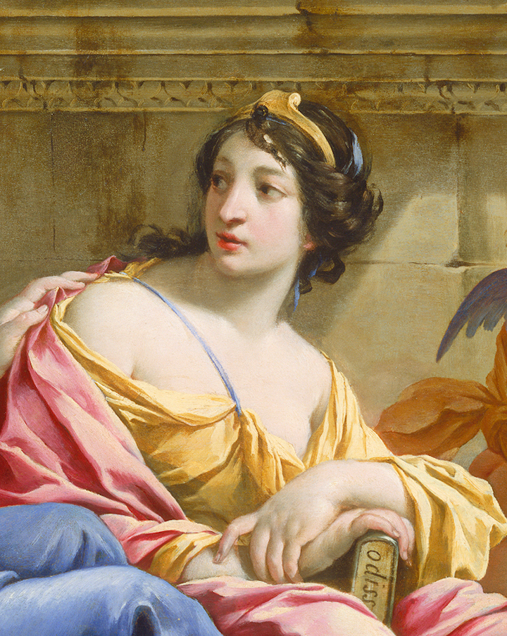
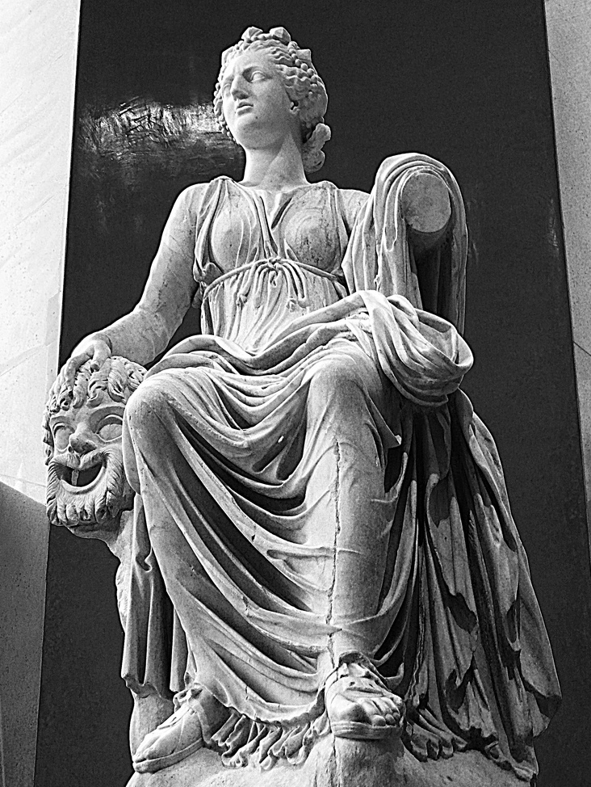
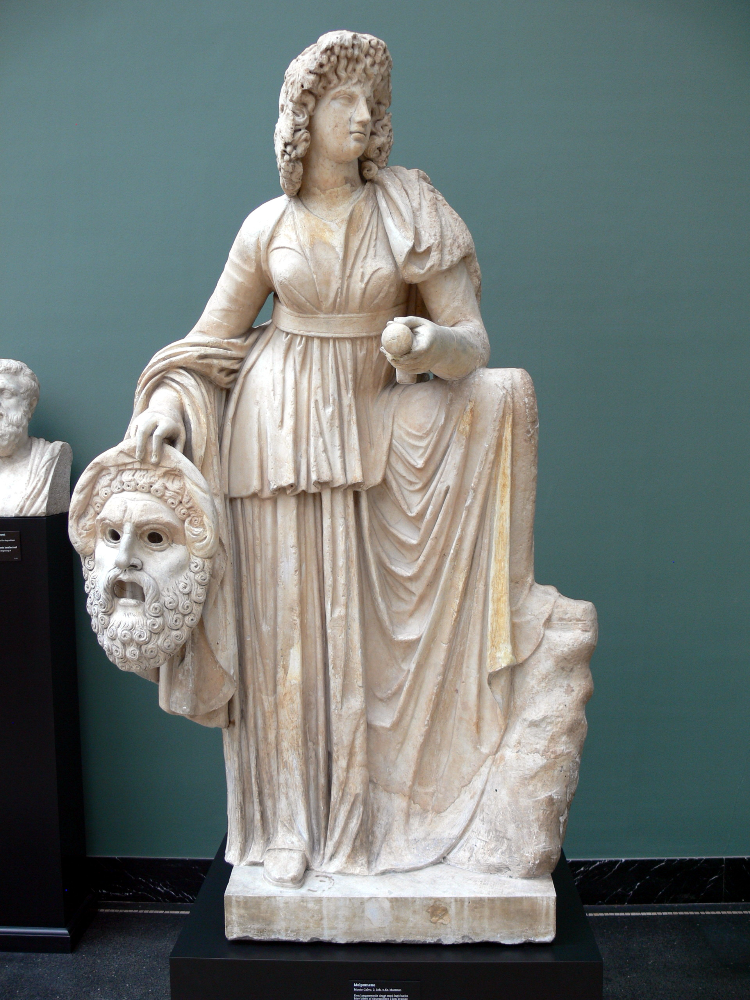
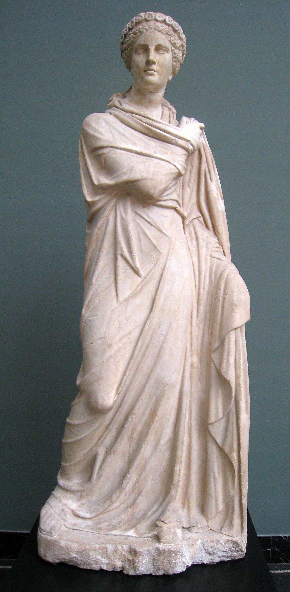

[Muses: The 9 Inspirational Goddesses of Greek Mythology - Mythology Dictionary - See U in History](https://www.youtube.com/watch?v=ORKCWfbrY8k "Play Video")

## Οὐρανία (Urania)

The Muse Of Astronomy

## Urania, 4th century BC

[The most detailed map of galaxies, black holes and stars ever made | Juna Kollmeier](https://www.youtube.com/watch?v=88d-58tWhGs "Play Video")

[A stellar history of modern astronomy | Emily Levesque](https://www.youtube.com/watch?v=TST0CsV8LHI "Play Video")

[An In-Depth Exploration Of Our Solar System | The Secrets Of The Universe | Spark](https://www.youtube.com/watch?v=JSAj91cU9-8 "Play Video")

[Segre Lecture: How Did The Universe Begin?](https://www.youtube.com/watch?v=e_4bMIqmV9U "Play Video")

[The Weirdest Stars in the Universe | Public Lecture](https://www.youtube.com/watch?v=uGsd0h1ADkA "Play Video")

[Interstellar Main Theme - Extra Extended - Soundtrack by Hans Zimmer](https://www.youtube.com/watch?v=UDVtMYqUAyw "Play Video")

## Καλλιόπη (Calliope)

The Muse who presides over eloquence and epic poetry.

## Detail of painting The Muses Urania and Calliope by Simon Vouet.

[The Eloquence Of Christopher Hitchens](https://www.youtube.com/watch?v=MJ2LehsA1dk "Play Video")

[The Epic Poetry Of Amanda Gorman](https://www.youtube.com/watch?v=LZ055ilIiN4 "Play Video")

[Maya Angelou Recites Inaugural Poem for Pres. Clinton](https://www.youtube.com/watch?v=MY5UsdZYmgU "Play Video")

[Poet Richard Blanco Delivers Inaugural Poem - Obama's Second Inauguration](https://www.youtube.com/watch?v=yJQeBgfzVgg "Play Video")

[Praise Song for the Day](https://www.youtube.com/watch?v=_vLBnFk-OFc "Play Video")

[Aretha Franklin Performs at the Inauguration of President Obama](https://www.youtube.com/watch?v=MJA1QRND3aw "Play Video")

[Classics Summarized: The Iliad](https://www.youtube.com/watch?v=faSrRHw6eZ8 "Play Video")

[The Iliad | Book Summary in English](https://www.youtube.com/watch?v=yVXMHK5U0Ic "Play Video")

[Classics Summarized: The Odyssey](https://www.youtube.com/watch?v=A-3rHQ70Pag "Play Video")

[A Long and Difficult Journey, or The Odyssey: Crash Course Literature 201](https://www.youtube.com/watch?v=MS4jk5kavy4 "Play Video")

[Classics Summarized: The Aeneid](https://www.youtube.com/watch?v=QRruBVFXjnY "Play Video")

[Kurt Vonnegut, Shape of Stories](https://www.youtube.com/watch?v=GOGru_4z1Vc "Play Video")

## Κλειώ (Clio)

The Muse of history.

## Clio, Muse of History by Charles Meynier

[Madison Calley's Harp (Pixar's Up)](https://www.youtube.com/watch?v=jSFLFgwsCkM "Play Video")

[Amy Turk's Harp (Toccata and Fugue in D Minor)](https://www.youtube.com/watch?v=oPmKRtWta4E "Play Video")

[Howard Zinn at MIT 2005 - The Myth of American Exceptionalism](https://www.youtube.com/watch?v=s6ym9B6I3UM "Play Video")

[Howard Zinn: A People's History of the United States (1999)](https://www.youtube.com/watch?v=Vn_m9WCd-88 "Play Video")

[Manufacturing Consent: Noam Chomsky and the Media](https://www.youtube.com/watch?v=EuwmWnphqII "Play Video")

[Education For Whom and For What?](https://www.youtube.com/watch?v=e_EgdShO1K8 "Play Video")

## Ἐρατώ (Erato)

Goddess of The Poetry Of Desire

## Roman statue of Erato (2nd century AD), playing the kithara or lyre.

[Dirty Dancing](https://www.youtube.com/watch?v=CQ2lUog6jZ0 "Play Video")

[Titanic 1997 Unseen](https://www.youtube.com/watch?v=O3JSzmJaP4c "Play Video")

[Time Machine - Godspeed](https://www.youtube.com/watch?v=D_MLe15qN_M "Play Video")

[Twilight, End of the Battle](https://www.youtube.com/watch?v=aTbvZv1lkyQ "Play Video")

## Θάλεια (Thalia)

Thalia presided over comedy and idyllic poetry.

## Roman statue of Thalia from Hadrian's villa, now at the Prado Museum (Madrid)

[Fran Drescher's Wasabi](https://www.youtube.com/watch?v=tkhTeMtm3XI "Play Video")

[Van Down By The River](https://www.youtube.com/watch?v=Xv2VIEY9-A8 "Play Video")

[Birth](https://www.youtube.com/watch?v=Nh2iyPmucFk "Play Video")

[Amish Paradise](https://www.youtube.com/watch?v=lOfZLb33uCg "Play Video")

[Julia Sweeney's Comedy](https://www.youtube.com/watch?v=C74-f4ZV-ss "Play Video")

[Always Look On The Bright Side Of Life](https://www.youtube.com/watch?v=SJUhlRoBL8M "Play Video")

## Μελπομένη (Melpomene)

Melpomene muse of chorus, eventually became the muse of tragedy.

## Roman statue of Melpomene, 2nd century AD.

[Jasmin Roberts - For White Poets](https://www.youtube.com/watch?v=r4ztwyBXsGc "Play Video")

[Asia Bryant-Wilkerson - White ppl are crzy!](https://www.youtube.com/watch?v=Tk35i5ivJvU "Play Video")

[Asia Bryant Wilkerson - The Pot Calls the Kettle Black](https://www.youtube.com/watch?v=o30cLzwVbE4 "Play Video")

[Porsha Olayiwola - Unnamed](https://www.youtube.com/watch?v=DwOY0Av2fxk "Play Video")

[Porsha Olayiwola - Water](https://www.youtube.com/watch?v=2LPCoHERA3g "Play Video")

[Porsha Olayiwola - Capitalism](https://www.youtube.com/watch?v=53kJF0DQtNo "Play Video")

[Porsha Olayiwola - Trigger](https://www.youtube.com/watch?v=xxw5AC-4zTg "Play Video")

[Sabrina Benaim - Explaining My Depression to My Mother](https://www.youtube.com/watch?v=aqu4ezLQEUA "Play Video")

[Slam Poetry - 5 Things I've learned from my mother](https://www.youtube.com/watch?v=op4Lqs34zSM "Play Video")

[Nora Cooper - I Won't Write Your Obituary](https://www.youtube.com/watch?v=vBvnuGIMRos "Play Video")

[To This Day ... for the bullied and beautiful - Shane Koyczan](https://www.youtube.com/watch?v=sa1iS1MqUy4 "Play Video")

[Los Angeles Team - Somewhere in America](https://www.youtube.com/watch?v=OadZpUJv8Eg "Play Video")

## Πολυύμνια (Polyhymnia)

Goddess of Hymns

## Roman statue of Polyhymnia, 2nd century AD, depicting her in the act of dancing.

[Johnny Cash - Hurt](https://www.youtube.com/watch?v=8AHCfZTRGiI "Play Video")

[Mylène Farmer feat. Gary Jules - Mad World (Timeless 2013 Live) - HD](https://www.youtube.com/watch?v=nz1OwLgRxOM "Play Video")

[Blue Oyster Cult - Don't Fear The Reaper (Single Version) (1976) (HD)](https://www.youtube.com/watch?v=oF7mP2LASCo "Play Video")

[Nowhere Man](https://www.youtube.com/watch?v=9E3ODsSRY6k "Play Video")

[Simon & Garfunkel - The Sounds of Silence](https://www.youtube.com/watch?v=4fWyzwo1xg0 "Play Video")

[Simon & Garfunkel - I Am A Rock](https://www.youtube.com/watch?v=JKlSVNxLB-A "Play Video")

[Rihanna - Diamonds](https://www.youtube.com/watch?v=lWA2pjMjpBs "Play Video")

[Adele - Skyfall](https://www.youtube.com/watch?v=q-gLRp5bSpw "Play Video")

[Enigma - Sadeness](https://www.youtube.com/watch?v=4F9DxYhqmKw "Play Video")

[James Brown, Can you see the light, Blues Brothers movie](https://www.youtube.com/watch?v=xbq0OuJtErs "Play Video")

[Louis Armstrong - What A Wonderful World](https://www.youtube.com/watch?v=VqhCQZaH4Vs "Play Video")

[Eddie Vedder - Guaranteed (Into The Wild)](https://www.youtube.com/watch?v=Mwx3RvDWvDM "Play Video")

[Wild, Ending Speech](https://www.youtube.com/watch?v=vmmH-2rWHH0 "Play Video")

[Wild, El Cóndor Pasa](https://www.youtube.com/watch?v=A41CQzqUj8c "Play Video")

## Εὐτέρπη (Euterpe)

Goddess of Music, Lyric Poetry.

## Euterpe (St. Petersburg)

[Dave Grohl and Animal Drum Battle - The Muppets](https://www.youtube.com/watch?v=3AZz9TSjZCM "Play Video")

[Ancient double aulòs - Tursen](https://www.youtube.com/watch?v=W27QxQl70fw "Play Video")

[How To Play A Double Native Flute](https://www.youtube.com/watch?v=D0fTgZH38-A "Play Video")

[Bettina Joy de Guzman](https://www.youtube.com/watch?v=l-W21cHtIJI "Play Video")

[LaWaJ - Teaser : Des Airs - Didgeridoo / Flute BeatBox](https://www.youtube.com/watch?v=TtECy8YuYQc "Play Video")

[William Barton's Didgeridoo](https://www.youtube.com/watch?v=cLu9GmV2vF0 "Play Video")

[Techno Didgeridoo in Perth](https://www.youtube.com/watch?v=ozOoNk6TnMU "Play Video")

[Khusugtun - Praise of Chinggis Khaan](https://www.youtube.com/watch?v=J5jI59BQjzs "Play Video")

[Clanadonia](https://www.youtube.com/watch?v=hnSNfxjrwck "Play Video")

[Crazy Drummers vs European X](https://www.youtube.com/watch?v=FFY3chGyYzY "Play Video")

[Nyangostar & Kaparu Mini ❤️](https://www.youtube.com/watch?v=nAwCcBMQBrc "Play Video")

[Khatia Buniatishvili's Etude op.10 no.12 by Frederic Chopin](https://www.youtube.com/watch?v=zMIFAFJ0FG4 "Play Video")

[Jain's Makeba (Makeba is someone who has the ability to soothe and calm a person in distress)](https://www.youtube.com/watch?v=59Q_lhgGANc "Play Video")

[Jain's Come](https://www.youtube.com/watch?v=KDXOzr0GoA4 "Play Video")

[Kenji Kawai](https://www.youtube.com/watch?v=aXGPERcDvio "Play Video")

[I Am a Man Of Constant Sorrow](https://www.youtube.com/watch?v=-ew_bfFvros "Play Video")

## Τερψιχόρη (Terpsichore)

Goddess of Dancing and Chorus.

## Terpsichore on an antique fresco from Pompeii

[The Owl and the Pussycat](https://www.youtube.com/watch?v=WAfPKNSvesI "Play Video")

[Rita Hayworth Sing and Dance Scene](https://www.youtube.com/watch?v=1pqiLwAjUI0 "Play Video")

[Down to Eath (1947) - Terpsichore Song](https://www.youtube.com/watch?v=eTckaxEhC5U "Play Video")

[Doris Day - Shaking the Blues Away](https://www.youtube.com/watch?v=Ktsfe2y3sIE "Play Video")

[The Addams Family Dance of Lurch & Wednesday Addams](https://www.youtube.com/watch?v=rLvbVLmzHNM "Play Video")

[Beetlejuice](https://www.youtube.com/watch?v=LWXwuhboZpA "Play Video")

[BeetleJuice Banana Boat Song](https://www.youtube.com/watch?v=yreHtMO2kCg "Play Video")

[Footloose Final Dance 1984 to 2011](https://www.youtube.com/watch?v=JyD8BxoB2To "Play Video")

[Pulp Fiction - Dance Scene](https://www.youtube.com/watch?v=WSLMN6g_Od4 "Play Video")

[Favorite video of ME AND MOM shuffling! 2017](https://www.youtube.com/watch?v=uoXrxLtNYWc "Play Video")

[Shuffle Tutorial Basics Running Man, T Step and Variations](https://www.youtube.com/watch?v=Kt-Tb9gaOB8 "Play Video")

[HOW TO SHUFFLE DANCE | Evelina](https://www.youtube.com/watch?v=RECaepj8LkU "Play Video")

[Anastasiia Kirilik's Ultimate Shuffle Dance Tutorial](https://www.youtube.com/watch?v=Dc6B14K1SZ8 "Play Video")
