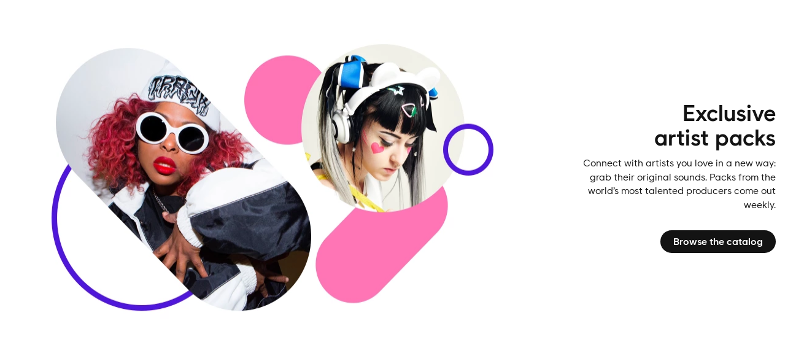

[Great Philosopher Jean Paul Sartre, plays the piano.](https://www.youtube.com/watch?v=TysXX7ZCV7g "Play Video")

## Important Music Tutorial

Please visit [Learning Music](https://learningmusic.ableton.com/) at Ableton, and take their music\
composition tutorial.

## The Masters of the Stereo

A **sample** of sound, is the same as a sample of cake, it is just a little\
bit of something larger. In the world of music, that little bit, would\
often be a defining sound in a song that captured your attention.

[Amiga Samplers : Budget dance music in 1990](https://www.youtube.com/watch?v=i9MXYZh1jcs "Play Video")

[Amen, Break: The Most Sampled Loop in Music History](https://www.youtube.com/watch?v=v89CjsSOJ_c "Play Video")

[How sampling transformed music by Mark Ronson](https://www.youtube.com/watch?v=H3TF-hI7zKc "Play Video")

## Art of Sampling

Creating sounds with a synthesizer can be tiring, not every sound you\
synthesize will be ground breaking. Back in the old days, listeners were\
not too happy with synthesized songs, people would actually call them UFO\
Sounds.

Some choose to skip sound synthesis and create/[download](https://old.reddit.com/r/Drumkits/) samples.\
Samples can be replayed at different frequencies, depending on which piano\
key you hit. In fact if you record a single piano key, you can almost\
recreate the piano entirely by replaying that one piano key at different\
frequencies/notes (A note like *middle C*, is just a named frequency, in\
this case 261.63 Hz.)

[Sampling](https://en.wikipedia.org/wiki/Sampling_\(music\)) is the art of borrowing a sound, or even a little bit of a song (as in Lofi Hip Hop) and frequently replaying it at a different frequency. You can also sample sounds around you to create unique drums, [hats](https://en.wikipedia.org/wiki/Hi-hat), even piano or some lo-tech violin out of [flinging a doorstop](https://www.youtube.com/watch?v=zS4gZcjSHk4). You can give beatboxing a try and build a song out of sampling/splicing the instruments you imitated with your own voice.

Downloadable Drumkits, are collections of short samples of instruments\
taken from various places, including other songs. Visit [r/Drumkits](https://www.reddit.com/r/Drumkits/) for\
some free downloads.

Additionally, [freesound](https://freesound.org/) has a huge library, and [Splice](https://splice.com/) has a well\
organized one aimed at musicians for $7.99/mo (the free trial is worth it).

[LoFi Synth-Hop](https://www.youtube.com/watch?v=mVxLhy1v-xU "Play Video")

[RZA - Flying Birds / Sample Rich Track](https://www.youtube.com/watch?v=DdVOwNyomw4 "Play Video")

[RZA'a Samurai Showdown (Lofi Hiphop)](https://www.youtube.com/watch?v=g4tbuu9GTaw "Play Video")

[Beatboxers](https://www.youtube.com/watch?v=ztPvUrQb9Vw "Play Video")

[The Science of Dubstep by James Humberstone](https://www.youtube.com/watch?v=d8s8e8JdGCc "Play Video")

[How to translate the feeling into sound by Claudio](https://www.youtube.com/watch?v=q5yxIzs5Wug "Play Video")

## Become a Rockstar!

Please remember what Claudio teaches us. A song is a story, it is not the\
back-beat, not the piano, not the twelve inch drum, or the bass head. A\
song is a story told with voice and music.

Grab a pencil, draw a line. Mark all the important events along the line.\
That's where the lyrics start or end, that's where the back-beat slows or\
picks up, that's where your listeners will start to laugh or start to cry.

We compose music, because the greatest of stories cannot be expressed in\
words.

## LMMS

[LMMS](https://lmms.io/) is a free, cross-platform tool for music composition.

Take a look at the [showcase](https://lmms.io/showcase), albums of songs made with LMMS.

[LMMS 1.2](https://www.youtube.com/watch?v=5j8c2qlih0M "Play Video")

[LMMS Tutorial 1: Piano Roll, Beat/Bass Line Editor](https://www.youtube.com/watch?v=4dYxV3tqTUc "Play Video")

[LMMS Tutorial 2: Sidebar](https://www.youtube.com/watch?v=Ow4fHTmd1mo "Play Video")

[LMMS Tutorial 3: TripleOscillator Basics](https://www.youtube.com/watch?v=7lI8VgbocQg "Play Video")

[How to Sing Any Song - Modified Lyrics - Felicia Ricci](https://www.youtube.com/watch?v=rJDc8p18fsE "Play Video")

[How To Sing Any Song - Voice Lessons - Ken Tamplin Vocal Academy](https://www.youtube.com/watch?v=ZATunybJm_4 "Play Video")

[How To Sing With Your Own Voice - Roger Burnley Voice Studio - Singing Vocal Lesson](https://www.youtube.com/watch?v=ytyLQ2Hl-H0 "Play Video")

## Anne Reburn

[Anne Reburn Channel on YouTube](https://www.youtube.com/channel/UChyNJxSsIXh2KyY3VvLnI2g)

[How Am I Feeling Today?](https://www.youtube.com/watch?v=zFnSCJ8h9c4 "Play Video")

[I'm A Believer](https://www.youtube.com/watch?v=SdM5DQxfGM0 "Play Video")

## Studio Acapellas

Search YouTube for [Studio Acapellas](https://www.youtube.com/results?search_query=Studio+Acapella) to discover vocal-only tracks of\
popular songs. It is much easier to understand what singing is about when\
you can hear the voice without music. You can search the web for "download\
youtube audio" and then load them into LMMS and create your own backbeat\
and remixes.

[P!nk - Fuckin' Perfect (Official Acapella) \[EXPLICIT\]](https://www.youtube.com/watch?v=f5TSlm79zc0 "Play Video")

[Mad World Gary Jules Real Official Acapella](https://www.youtube.com/watch?v=oRoauAOgWuw "Play Video")

## Izzie Naylor

You don't need a strong beat to make a song work. Izzie Naylor is proof\
that minimalist songs are often very beautiful.

[Smile, Ukulele Cover by Izzie Naylor](https://www.youtube.com/watch?v=Z8ZShEgGt-4 "Play Video")

[Gary Jules - Mad World (live)](https://www.youtube.com/watch?v=D1Nq086QB1Q "Play Video")

## Community Links

*   [/r/Drumkits](https://www.reddit.com/r/Drumkits/)
*   [/r/MakingHipHop](https://www.reddit.com/r/MakingHipHop)
*   [/r/EdmProduction](https://www.reddit.com/r/EdmProduction)
*   [/r/TrapProduction](https://www.reddit.com/r/TrapProduction)
*   [/r/WeAreTheMusicMakers](https://www.reddit.com/r/WeAreTheMusicMakers)
*   [/r/IsolatedVocals/](https://www.reddit.com/r/IsolatedVocals/)

## Bandcamp Music Sales

Sell your music on [Bandcamp](https://bandcamp.com/artists) (free).

## Splice Sample Sales

[Sell](https://support.splice.com/hc/en-us/articles/115006379848-Where-can-I-submit-my-own-samples-or-sample-packs-) your [quality](https://splice.com/blog/splice-sounds-quality-principles/) music samples on [Splice](https://splice.com/).

Consider creating less restrictive music/sample sharing platforms (see The Founder)

## How to Share

Upload your music to [Soundcloud](https://soundcloud.com) you get 180 minues of music space for\
free (per account).
