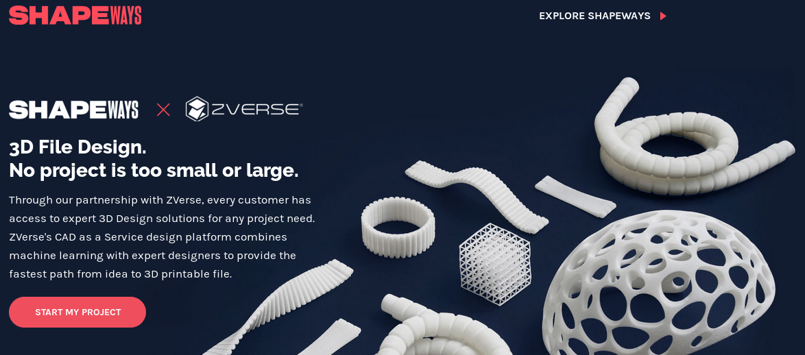

## Quote by Auguste Rodin

> Where did I learn to understand sculpture? In the woods by looking at the\
> trees, along roads by observing the formation of clouds, in the studio by\
> studying the model, everywhere except in the schools.
>
> \-- Auguste Rodin - https://en.wikipedia.org/wiki/Auguste\_Rodin

[Cubli](https://www.youtube.com/watch?v=n_6p-1J551Y "Play Video")

[Water No. 33 by Dean O'Callaghan](https://www.youtube.com/watch?v=ZqzjAmPFND8 "Play Video")

[Colibri by Derek Hugger](https://www.youtube.com/watch?v=1scj5sotD-E "Play Video")

[Kinetic Sculptures Intro](https://www.youtube.com/watch?v=zqNnOYoU5ls "Play Video")

[Kinetic sculptures by Alex Harrell](https://www.youtube.com/watch?v=Ibq1crh0OFA "Play Video")

[Kinetic Sculpture by David Roy](https://www.youtube.com/watch?v=nxdcj2tLQGE "Play Video")

[Kinetic Masterpieces by Anthony Howe](https://www.youtube.com/watch?v=J4l5rHNSq9s "Play Video")

[Wintergatan by Martin Molin](https://www.youtube.com/watch?v=IvUU8joBb1Q "Play Video")

## Blender

Blender is a Free and Open Source Program with a large developer community.

[MODELING For Absolute Beginners - Blender Tutorial](https://www.youtube.com/watch?v=ICBP-7x7Chc "Play Video")

[B3d/ZB/MD: Threadox Pt.1](https://www.youtube.com/watch?v=lp9JO7qpIO4 "Play Video")

[Blender 2.8 Mecha Sculpting In Dyntopo - Blender Tutorial](https://www.youtube.com/watch?v=a-Nsphndbj8 "Play Video")

## ZBrush

Zbrush is a commercial product priced at $1,000.

(I recommend learning Blender)

[Organic Sculpting with Maria Panfilova](https://www.youtube.com/watch?v=G3SVAN9TPbo "Play Video")

[Joker Speed Art (Zbrush)](https://www.youtube.com/watch?v=k00bCwWH92E "Play Video")

[Speedsculpt Zbrush](https://www.youtube.com/watch?v=GhYwHcp-UV8 "Play Video")

## Air Dry Clay

Air Dry clay can be purchased for $25 for 25lb at [Amazon](https://www.amazon.com/AMACO-AMA46317P-Clay-Gray-lbs/dp/B0009RRTA8/ref=sr_1_10?keywords=air+drying+clay\&qid=1574898467\&sr=8-10)

[Speed Sculpting - What you NEED to Know](https://www.youtube.com/watch?v=H4WtpO8vfTU "Play Video")

## 3D Printing

Shapeways offer printing services, but you can also purchase your own [3D\
Printer](https://en.wikipedia.org/wiki/3D_printing) for quicker prototyping

[3D Printing Cast Metals via Shapeways](https://www.youtube.com/watch?v=9uxE_r9kEE8 "Play Video")

[Why This Is the Best 3D Printer - Comparing ALL My Printers!!!](https://www.youtube.com/watch?v=YzF5YnUuN4Q "Play Video")

## Shapeways Laser Printing

[Sell](https://www.shapeways.com/marketplace) your 3D models through Printing on Demand (POD, printing only when someone pays for your product) at [Shapeways](https://www.shapeways.com/) and similar 3d print shops. Shapeways created [shapejs](https://shapejs.shapeways.com/) a programmable product creator with many [examples in JavaScript](https://shapejs.shapeways.com/v2/examples), this can be used to generate a large number of unique products (antique coin pendants, tiny statues of art in public domain, odd bobble heads, skeleton wallets, waveform rings, UPC/QR code bracelets or keychain doodads.).

## Scanned Model Sales

You are not limited to digital models, you can experiment with [3d\
scanners](https://en.wikipedia.org/wiki/3D_scanning) as well. Take a look at the [Shapeways Marketplace](https://www.shapeways.com/marketplace) for\
more ideas.

[Explaining 3D Scanning](https://www.youtube.com/watch?v=TTCiOoedUco "Play Video")

[Best 3D Scanners 2019](https://www.youtube.com/watch?v=20b2JWz2TfE "Play Video")
